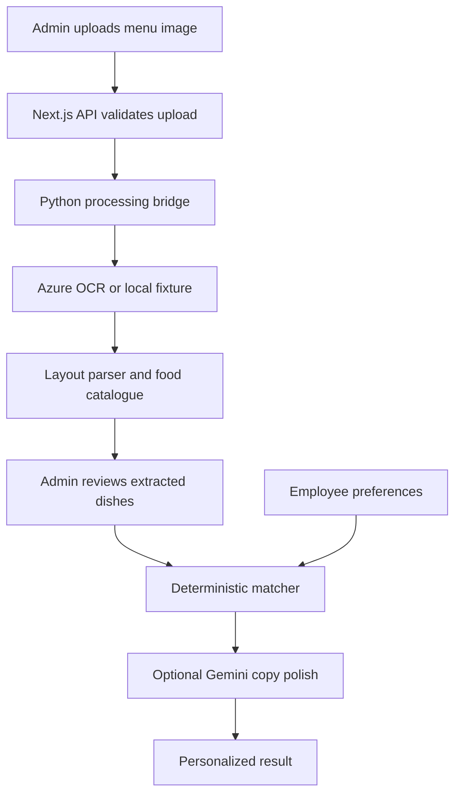

# CafeteriaBuddy

[](https://github.com/Shubhank2604/CafeteriaBuddy/actions/workflows/ci.yml)
[](LICENSE)

CafeteriaBuddy turns cafeteria menu images into structured breakfast and lunch menus, then gives each employee a personalized food score, plate ideas, and item-level recommendations.

It combines a Next.js application with a Python extraction pipeline, Azure Document Intelligence for layout-aware OCR, Gemini for optional enrichment and recommendation copy, and local SQLite storage. Deterministic rules own allergy and hard-avoid decisions; Gemini cannot promote an excluded dish.

Originally developed as **MealWorks** for MathWorks HackDay, the project placed **3rd among 39 teams and 90+ participants**. This repository extends that prototype with a credential-free demo, repeatable benchmarks, and CI.


## Measured baselines

| Evaluation | Dataset | Result | What it establishes |
| --- | --- | --- | --- |
| Restriction rules | 36 labeled dish/restriction pairs | `1.000` recall, `0.714` precision | The conservative matcher caught every labeled conflict; eight ambiguous names were excluded unnecessarily |
| Menu parser | 2 versioned layouts, 11 stations, 55 item/station labels | `1.000` precision and recall | The parser preserved every labeled station and dish assignment after fixture text extraction |
| CI | Python tests, TypeScript tests, ESLint, parser gate, Next.js build | Runs without repository secrets | Core behavior and the production web build are checked on every pull request |

These are regression baselines over versioned fixtures, not claims about medical safety, Azure OCR accuracy, or unseen menu layouts. The datasets, commands, and error analysis are documented in [restriction-rule evaluation](docs/safety-evaluation.md) and [menu parsing evaluation](docs/parsing-evaluation.md).

## What it does

### Employees

- Register and maintain dietary preferences, allergies, dislikes, goals, and temporary restrictions.
- Browse daily and weekly menus with timezone-aware date navigation.
- See a personal food-fit score, recommended plates, suitable dishes, cautions, and skips.
- Understand why a dish was recommended or excluded.
- Provide item-level feedback and optionally receive email digests.

### Cafe administrators

- Upload separate breakfast and lunch images for a selected date.
- Extract station and dish information with Azure Document Intelligence.
- Review and edit dish names and tags before employees use the menu.
- Preview recommendations for different employee profiles.
- Manage administrator access and trigger digest workflows.

### Processing pipeline

- Validates image files and tracks menu revisions.
- Parses known breakfast and lunch layouts by station.
- Resolves recurring dishes into a canonical food catalogue with aliases.
- Enriches foods with categories, ingredients, dietary attributes, and allergens.
- Applies deterministic allergy and hard-avoid rules before optional Gemini polishing.
- Produces compact OCR and parsed-menu artifacts for auditing.

## Architecture



| Layer | Technology | Responsibility |
| --- | --- | --- |
| Web application | Next.js 16, React 19 | UI, authentication, admin tools, API routes, feedback, and digests |
| Extraction | Python, FastAPI, SQLModel | Image ingestion, OCR orchestration, parsing, catalogue resolution, and standalone APIs |
| OCR | Azure Document Intelligence or local fixture | Layout-aware extraction in production; deterministic public demo and tests |
| AI | Gemini or stub provider | Optional enrichment and recommendation copy; hard exclusions stay deterministic |
| Storage | SQLite | Separate web and extraction/catalogue databases under `data/` |

The web app invokes Python directly during menu uploads. You do not need to run the FastAPI server for normal use. See [the architecture notes](docs/architecture.md) for component boundaries, trade-offs, reliability limits, and the verification strategy.

### Engineering decisions

| Decision | Reason | Trade-off |
| --- | --- | --- |
| Deterministic safety rules before generation | Keeps allergy and explicit-avoid decisions inspectable and prevents the LLM from softening an exclusion | Conservative matching produces false positives that require cafe confirmation |
| Administrator review before publication | Treats OCR output as a draft and gives operators a correction point | Adds a manual step to the upload workflow |
| Provider adapters with local implementations | Makes the complete flow and CI reproducible without Azure or Gemini credentials | Local fixtures demonstrate orchestration and parsing, not general OCR quality |
| SQLite for product and catalogue state | Keeps local setup small and the data easy to inspect | Targets a single-instance deployment rather than horizontal scaling |

## Credential-free demo

The fastest way to inspect the product does not require Azure or Gemini:

```bash
git clone https://github.com/Shubhank2604/CafeteriaBuddy.git
cd CafeteriaBuddy

python -m venv .venv
source .venv/bin/activate              # macOS/Linux
# .\.venv\Scripts\Activate.ps1       # Windows PowerShell
python -m pip install -r requirements.txt

npm ci
npm run demo
```

Open [http://localhost:3000](http://localhost:3000) and sign in with `cafe.admin@example.com` / `demo-password-change-me`. The demo uses local OCR fixtures, stub AI enrichment, local embeddings, and SQLite. `npm run demo` creates `.env` from `.env.demo.example` only when `.env` does not already exist.

The local OCR adapter demonstrates parsing, catalogue, review, and recommendation behavior deterministically. It is not a general-purpose OCR model.

## Cloud-backed setup

### Prerequisites

- Node.js 20.9 or newer
- Python 3.11 or newer recommended
- An Azure Document Intelligence resource
- A Gemini API key

### Install

```bash
git clone https://github.com/Shubhank2604/CafeteriaBuddy.git
cd CafeteriaBuddy

python -m venv .venv
source .venv/bin/activate              # macOS/Linux
# .\.venv\Scripts\Activate.ps1       # Windows PowerShell
python -m pip install -r requirements.txt

npm ci
cp .env.example .env                   # macOS/Linux
# Copy-Item .env.example .env          # Windows PowerShell
npm run dev
```

Update `.env` before using live extraction or AI features. Never commit this file.

| Variable | Required | Purpose |
| --- | --- | --- |
| `AUTH_SECRET` | Yes | Signs application sessions; use a long random value |
| `ADMIN_EMAIL` | Yes | Seeds the local cafe administrator account |
| `ADMIN_PASSWORD` | Yes | Password for the seeded administrator; there is no source-code fallback |
| `OCR_PROVIDER` | Yes | Use `document_intelligence` for live extraction or `local` for the fixture |
| `AZURE_DOCUMENT_INTELLIGENCE_ENDPOINT` | For live OCR | Azure resource endpoint |
| `AZURE_DOCUMENT_INTELLIGENCE_KEY` | For live OCR | Azure resource key |
| `LLM_PROVIDER` | Yes | Use `gemini` for enrichment or `stub` for deterministic local behavior |
| `GEMINI_API_KEY` | For Gemini | Enables enrichment, preference interpretation, and match polishing |
| `GEMINI_MODEL` | For Gemini | Defaults to `gemini-3-flash-preview` |
| `PYTHON_EXECUTABLE` | Yes | Python executable used by the web-to-pipeline bridge |
| `SMTP_*` and `EMAIL_FROM` | No | Enables scheduled email digests |

Generate an authentication secret with Node.js:

```bash
node -e "console.log(require('crypto').randomBytes(32).toString('hex'))"
```

See [.env.example](.env.example) for the complete deployment configuration template.

## Posting a menu

1. Sign in with the configured administrator email and password.
2. Open **Admin** and select **Post**.
3. Select the date and choose **Breakfast** or **Lunch**.
4. Upload a JPEG or PNG image.
5. Review the extracted dishes under **Extraction** and correct names or tags if needed.
6. Upload the other meal. Existing breakfast items are preserved when lunch is posted, and vice versa.
7. Open **Today** with an employee account to generate the personalized result.

Source images are organized as `images/YYYYMMDD/breakfast.ext` and `images/YYYYMMDD/lunch.ext`. Generated databases, OCR responses, parsed artifacts, and browser upload copies stay in ignored runtime directories.

## Quality checks

```bash
python -m pytest -q
npm test
npm run lint
npm run build
```

GitHub Actions runs these checks for every pull request to `main`. The test configuration uses local providers and does not receive repository secrets.

### Restriction-rule details

The versioned 36-case benchmark reports `1.000` recall and `0.714` precision. The matcher intentionally favors recall, so ambiguous names can be conservatively excluded. See [the methodology and known false positives](docs/safety-evaluation.md). This evaluates rule matching, not medical safety or ingredient completeness.

### Menu-parser details

The deterministic parser correctly recovers all 11 station headings and all 55 item/station labels from the versioned breakfast and lunch fixture text. CI requires item/station recall of at least `0.98`. See [the parsing evaluation](docs/parsing-evaluation.md) for the dataset, command, and limitations. This measures parsing after text extraction; it does not measure Azure OCR accuracy or performance on unseen menu layouts.

## Project structure

```text
adapters/       Azure Document Intelligence, local OCR, and Gemini adapters
pipeline/       Ingestion, parsing, catalogue, enrichment, matching, and profiles
scripts/        Processing, audit, cleanup, enrichment, and demo utilities
src/app/        Next.js pages and API routes
src/components/ Shared user-interface components
src/lib/        Authentication, database, matching, Gemini, email, and Python bridge
templates/      Breakfast and lunch station-layout definitions
tests/          Python pipeline test suite
images/         Versioned OCR fixtures and date-based source menus
```

## Safety boundary and deployment scope

- `data/menu-match.db` stores web users, preferences, menus, matches, and feedback.
- `data/apple_hill_cafe_bot.db` stores ingestions, occurrences, canonical foods, aliases, and enrichments.
- Allergy and hard-avoid decisions are enforced by deterministic rules; Gemini cannot promote a hard-excluded dish.
- `.env`, databases, OCR artifacts, uploaded runtime images, `.next`, virtual environments, and `node_modules` are excluded from Git.

The current evidence covers deterministic rule matching and parsing of two known menu layouts after text extraction. It does not validate ingredient completeness, medical safety, Azure OCR accuracy, or performance on unseen layouts. Uncertain items are surfaced as cautions and should be confirmed with the cafe.

## Contributing and security

See [CONTRIBUTING.md](CONTRIBUTING.md) for the development workflow and [SECURITY.md](SECURITY.md) for responsible disclosure and sensitive-data guidance.

Licensed under the [MIT License](LICENSE).
