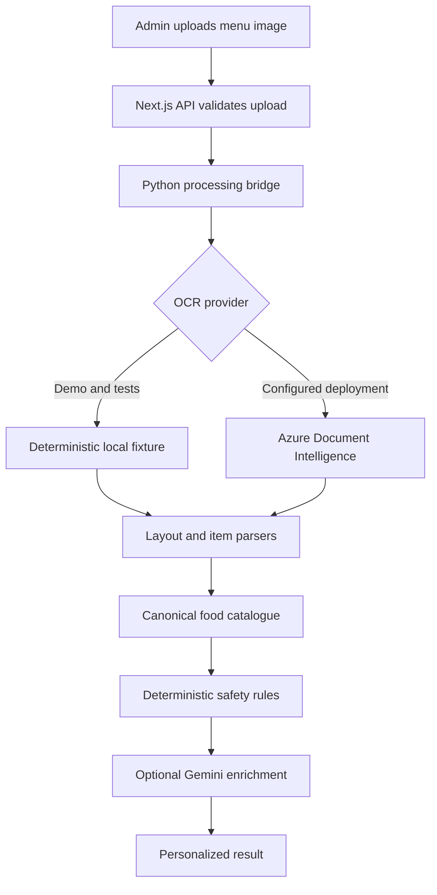

# Architecture and engineering decisions

CafeteriaBuddy is split into a Next.js product surface and a Python menu-processing pipeline. The boundary is deliberate: the web application owns users and product workflows, while the pipeline owns OCR, menu normalization, catalogue resolution, and food-safety classification.

## Request flow

The FastAPI server exposes the Python capabilities independently, but the normal web flow invokes Python directly. This keeps local setup small while retaining a clean service boundary if the pipeline is deployed separately later.

## Component boundaries

| Component | Owns | Does not own |
| --- | --- | --- |
| Next.js application | Authentication, profiles, uploads, review UI, recommendations, feedback, digests | OCR implementation and catalogue normalization |
| Python pipeline | OCR orchestration, parsing, ingestion revisions, catalogue resolution, enrichment | Browser sessions and product authorization |
| Deterministic matcher | Diet and allergy exclusions, scoring, explanations | Generative rewriting of hard safety decisions |
| Gemini integration | Optional enrichment and user-facing copy | Overriding hard exclusions |
| SQLite stores | Local product and catalogue state | Multi-node coordination or managed backups |

## Important decisions

### Deterministic rules before generation

Allergies and explicit avoidances are applied before optional LLM polishing. A model can improve an explanation, but it cannot promote an excluded dish. This favors predictable behavior over a fully generative recommendation pipeline.

### Reviewable extraction

OCR output is treated as a draft. Administrators review and edit parsed dishes before employees rely on the menu. Raw OCR and parsed artifacts are retained locally so an incorrect result can be traced.

### Provider adapters

OCR, embeddings, and LLM behavior sit behind provider boundaries. CI and the public demo use deterministic local implementations, while a configured deployment can use Azure and Gemini. Tests therefore do not need network access or secrets.

### Local-first storage

SQLite makes the project easy to run and inspect. It is appropriate for a single-instance demonstration, not horizontal scaling. A production deployment would move state to a managed relational database, add migrations and backups, and use an external job runner for digests.

## Reliability boundaries

- Ingredient and allergen inference is incomplete; uncertain dishes are surfaced as cautions.
- The local OCR provider is a deterministic fixture for demonstrating the pipeline, not a general OCR engine.
- The in-process digest scheduler is suitable for local use. Production should use an external scheduled job with idempotency and delivery tracking.
- The web and Python databases are separate. Cross-database operations are not atomic.
- Uploaded menu images may contain sensitive operational information and should follow an explicit retention policy in a real deployment.

## Verification strategy

The Python suite tests parsing, ingestion revisions, provider failures, catalogue behavior, food matching, and safety classifications. The TypeScript suite tests product-side matching behavior. GitHub Actions executes both suites, linting, and a production Next.js build for every pull request to `main`.
